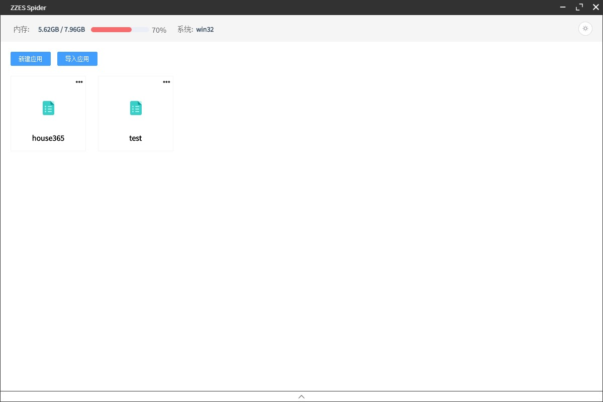
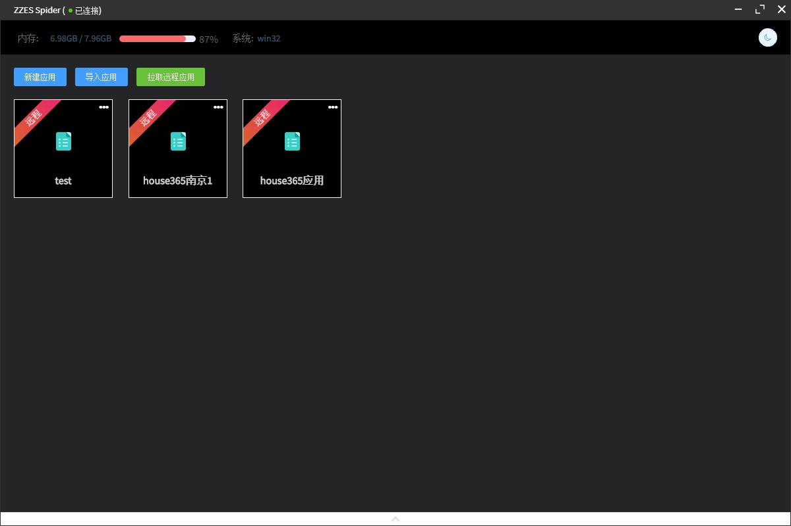
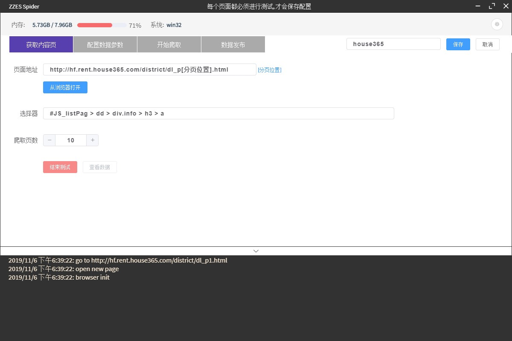
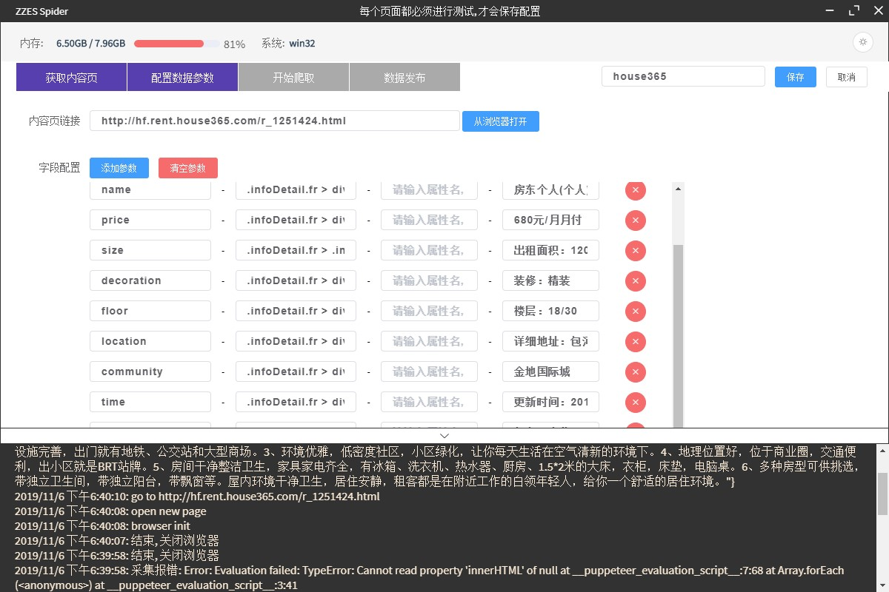
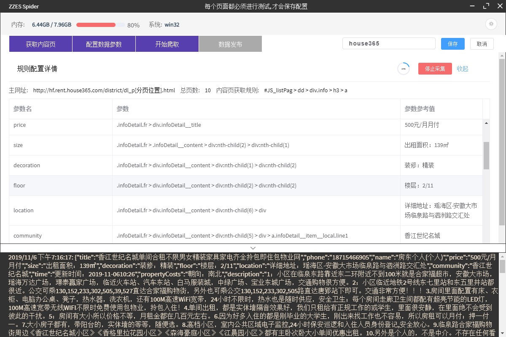
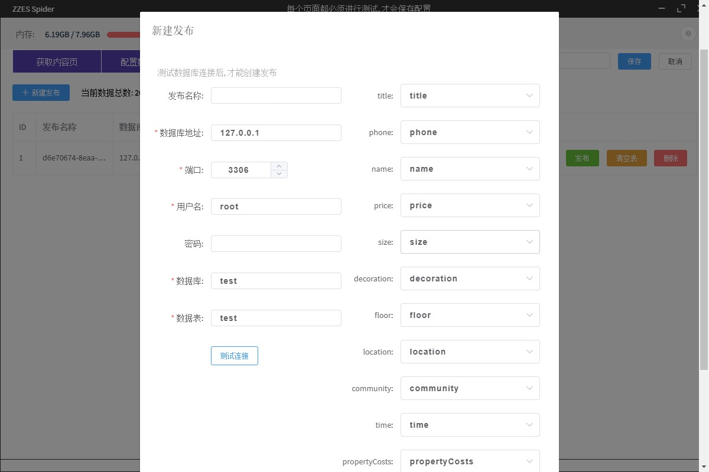
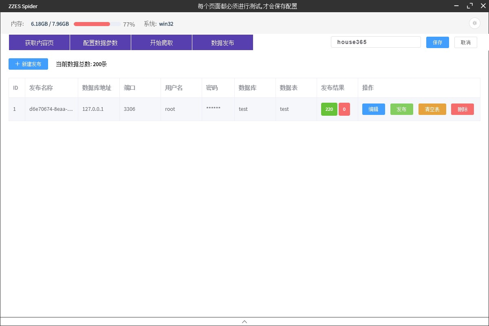
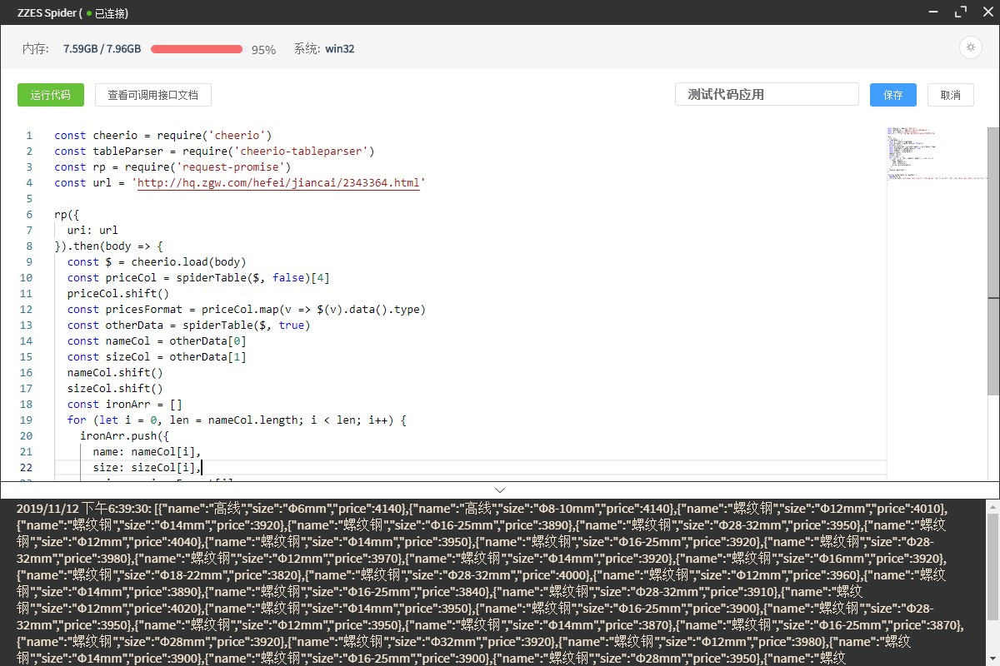

# 治电爬虫程序

### 功能

 - 夜间模式
 - 创建/修改应用
 - 导入/导出应用
 - 数据采集
 - 数据发布 (MySQL), 可导出Excel, JSON文件
 - 本地应用上传, 远程应用获取
 - 客户端与服务端通信
 - 新增代码应用
 - 插入代码片段功能

### 开发与打包

``` bash
# install dependencies
npm install

# serve with hot reload at localhost:9080
npm run dev

# build electron application for production
npm run build


# lint all JS/Vue component files in `src/`
npm run lint

```

### 相关问题
#### 1.导入示例应用
a.文件夹名称: `example`

b.应用: 

 - house365应用.zpk
 - 代码测试应用.zpk

c.导入
在主页面点击导入应用, 选取`.zpk`文件导入即可


#### 2.代码应用相关调用类库和方法
```javascript
{ name: 'fs', info: 'NodeJS内置文件操作库' }
{ name: 'path', info: 'NodeJS内置路径操作库' }
{ name: 'reqest', info: 'HTTP请求库' }
{ name: 'request-promise', info: '基于Promise的HTTP请求库' }
{ name: 'cheerio', info: 'HTML解析库' }
{ name: 'cheerio-tableparser', info: 'HTML表格解析的Cheerio插件' }
{ name: 'mysql2', info: 'MySQL操作库' }
{ name: 'puppeteer-core', info: '操作Chrome库' }
{ name: 'electron', info: '操作Electron窗体相关API' }
{ name: 'dataDb', info: '操作本地JSON数据存储, 用于本地存储数据' }
{ name: 'chromePath', info: '本地Chrome安装路径' }
```

### 运行截图








