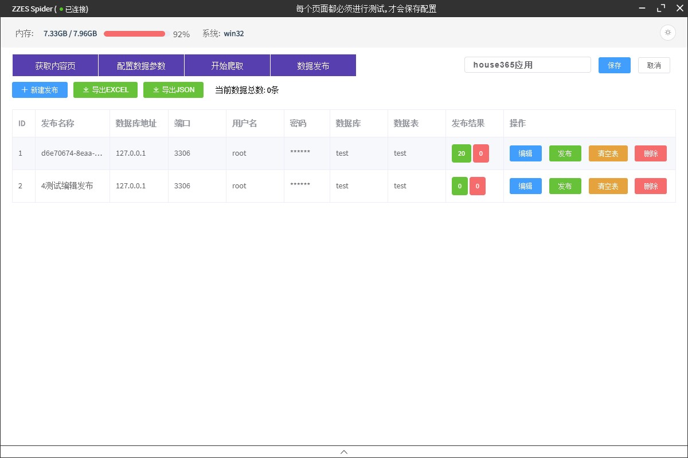

# 治电爬虫程序

#### 功能

 - 创建/修改应用
 - 导入/导出应用
 - 数据采集
 - 数据发布 (MySQL)

#### 开发与打包

``` bash
# install dependencies
npm install

# serve with hot reload at localhost:9080
npm run dev

# build electron application for production
npm run build


# lint all JS/Vue component files in `src/`
npm run lint

```

#### 运行截图



